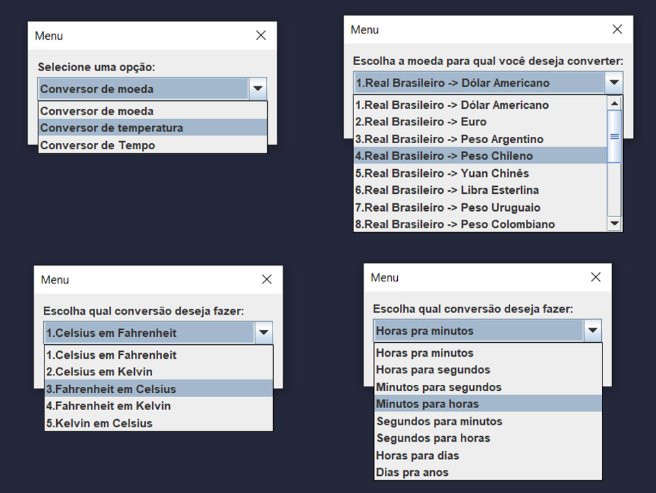

</br>
<div align="center">
  
</div>
</br>

## :dart: Descrição do Projeto

<p>O desafio é elaborar um conversor de moedas </p>

História

Nesta oportunidade foi solicitado para nós Devs a criação de um conversor de moeda utilizando a linguagem Java. As características solicitadas por nosso cliente são as seguintes:

O conversor de moeda deverá:

```
1. Converter de Reais a Dólar;
2. Converter de Reais a Euro;
3. Converter de Reais a Libras Esterlinas;
4. Converter de Reais a Peso argentino;
5. Converter de Reais a Peso Chileno;

```

Lembrando que deve ser possível também converter de forma inversa.


## :memo: Medidas de conversão utilizadas

### Moeda: 
1. Real Brasileiro -> Dólar Americano
2. Real Brasileiro -> Euro
3. Real Brasileiro -> Peso Argentino
4. Real Brasileiro -> Peso Chileno
5. Real Brasileiro -> Yuan Chinês
6. Real Brasileiro -> Libra Esterlina
7. Real Brasileiro -> Peso Uruguaio
8. Real Brasileiro -> Peso Colombiano
9. Dólar Americano -> Real Brasileiro
10. Euro -> Real Brasileiro
11. Peso Argentino -> Real Brasileiro
12. Peso Chileno -> Real Brasileiro
13. Yuan Chinês -> Real Brasileiro
14. Libra Esterlina -> Real Brasileiro
15. Peso Uruguaio -> Real Brasileiro
16. Peso Colombiano -> Real Brasileiro


### Temperatura:

1. Celsius em Fahrenheit
2. Celsius em Kelvin
3. Fahrenheit em Celsius
4. Fahrenheit em Kelvin
5. Kelvin em Celsius


### Tempo:

1. Horas pra minutos
2. Horas para segundos
3. Minutos para segundos
4. Minutos para horas
5. Segundos para minutos
6. Segundos para horas
7. Horas para dias
8. Dias pra anos


## :bulb: Prints:

</br>
<div align="center">
  
</div>
</br>


<h2>Conversão de moedas em tempo real</h2>

Para obter a taxa de conversão entre moedas em tempo real, foi utilizada API de Cotações - AwesomeAPI, que nos fornece dados empo real com mais de 150 moedas!


<div>
<p><a href="https://docs.awesomeapi.com.br/api-de-moedas">Link</a> para AwesomeAPI.</p>
</div>

<h2>Ferramentas utilizadas</h2>

* Visual Studio Code